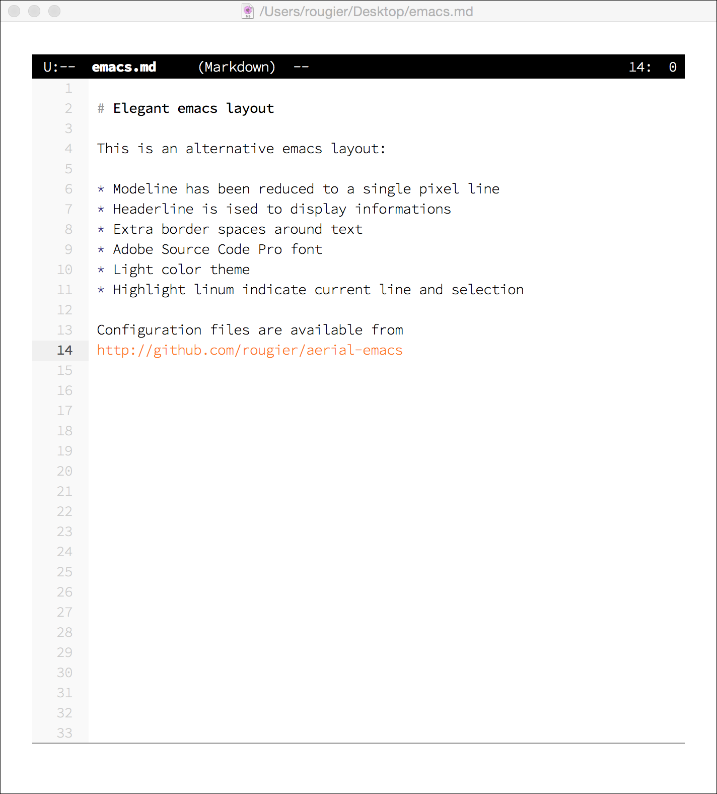

# Aerial emacs

This is an alternative layout to provide a cleaner and less cluttered
style for emacs:

* Modeline is reduced to a single pixel line
* Header line is used to display information
* Extra border spaces have been added
* Font is "Adobe Source Code Pro"
* Highlight linum indicate current line and selection

Configuration files are available from
http://github.com/rougier/aerial-emacs

